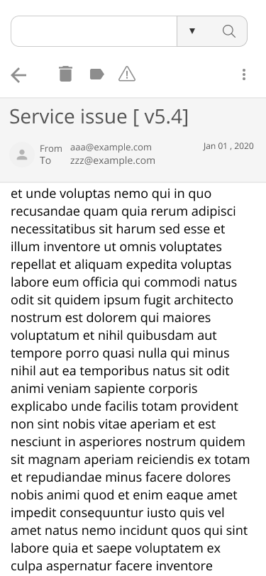

# Suggested Improvements

* Pagination

Individuals of an organization tend to get a lot of emails & as we know this system archives the emails of an organization. so, it will get thousands of archives a day. if the app calls the backend for all emails at once. it would be very inefficient and slow. which led to both bad user experience and strain on servers and so having pagination which fixes those issues.

* Delete Option

well As an archive doesn't need to have a delete option but most mails are spam so keeping them would be a waste of memory.

* Mark as Important

There would be many emails that are very important for the organization having those marked as important would a great way to find them when require.

* Label/Tag

labeling email by its type would be a great way of finding leads for security incidents(such as labeling suspicious for sharing sensitive information about the organization with someone).

* More Filters in the Search box

Filters like from and to filters(already added), mails size filter, has attachments, exclude words, labels, and mark as important filters, etc
having many filters will make searching for them easy.

## 

## UI mockup

* [Figma link](https://www.figma.com/file/UXnPYQWfcexuY5DwraAOoY/Hennge?node-id=0%3A1)
* [.Fig File](UI_mockup/Hennge.fig)

### Inside Mail

### With Mail

### Without Mail

