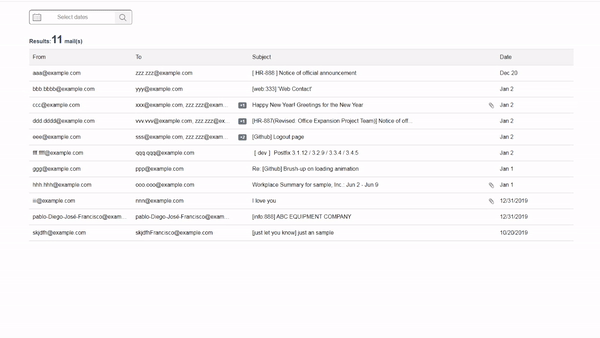
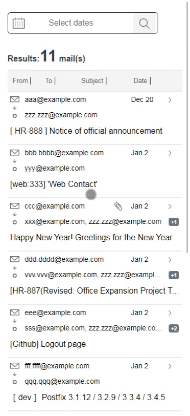
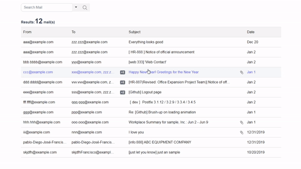
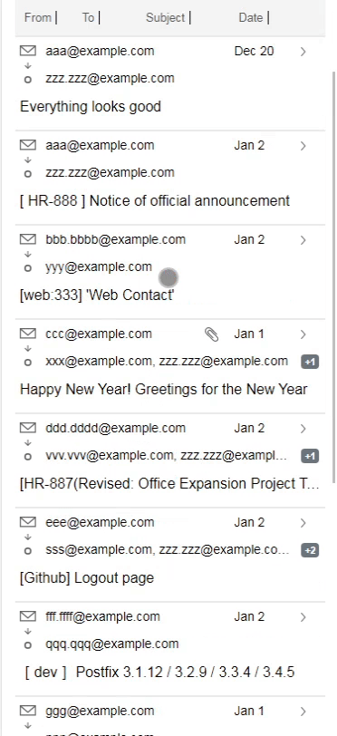

# Henge-Addmission-Challenge

## v1.0 Mission-1

### Mac Preview

### iPhone Preview


## v1.1 Mission-2

### Mac Preview

### iPhone Preview


## Project setup
```
npm install
```

### Compiles and hot-reloads for development
```
npm run serve
```

### Compiles and minifies for production
```
npm run build
```

### Lints and fixes files
```
npm run lint
```

### Customize configuration
See [Configuration Reference](https://cli.vuejs.org/config/).
